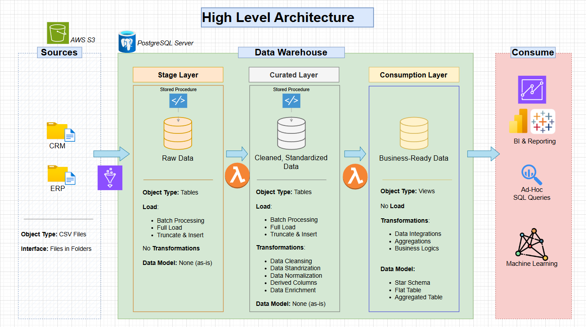
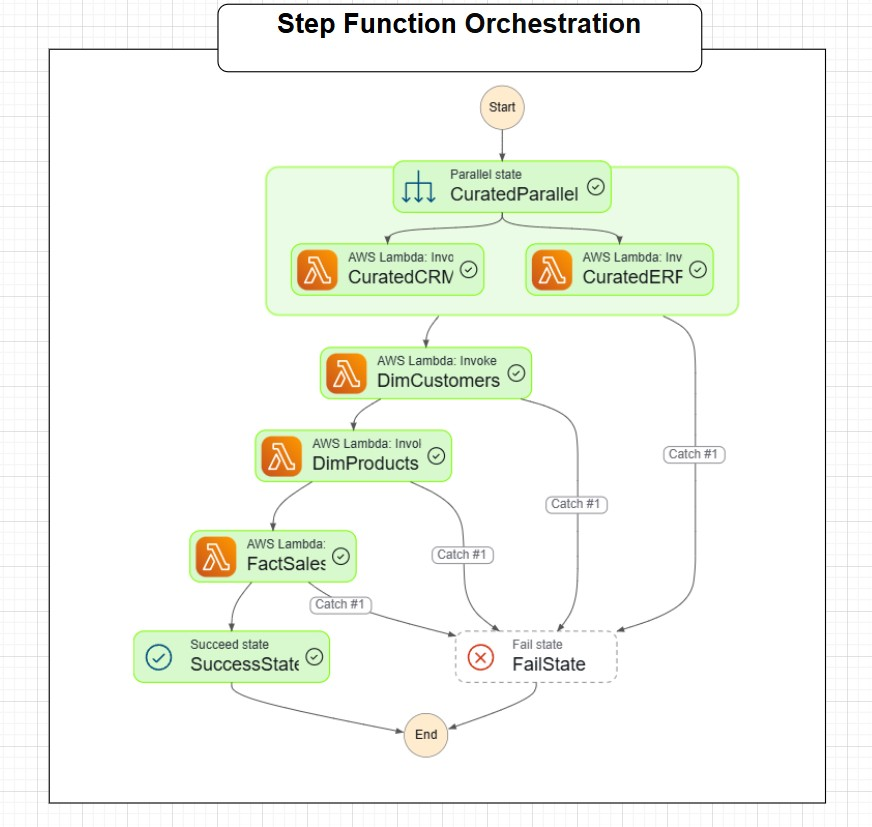
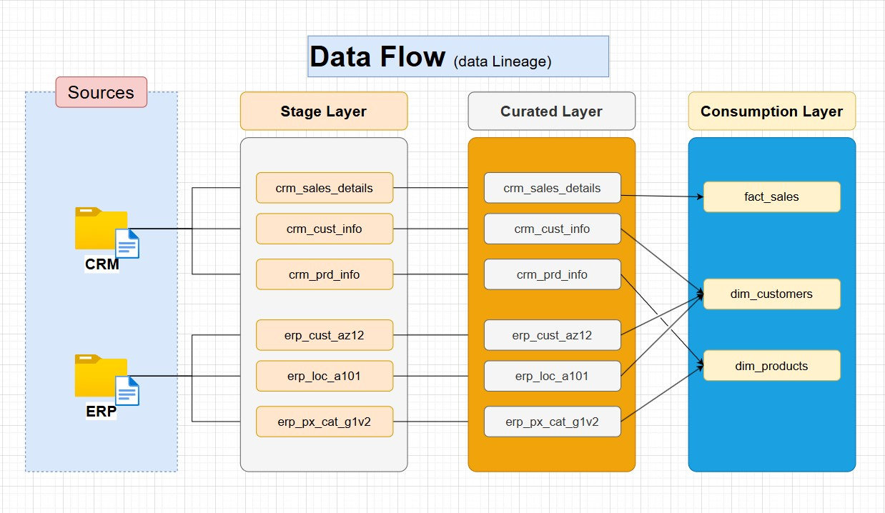
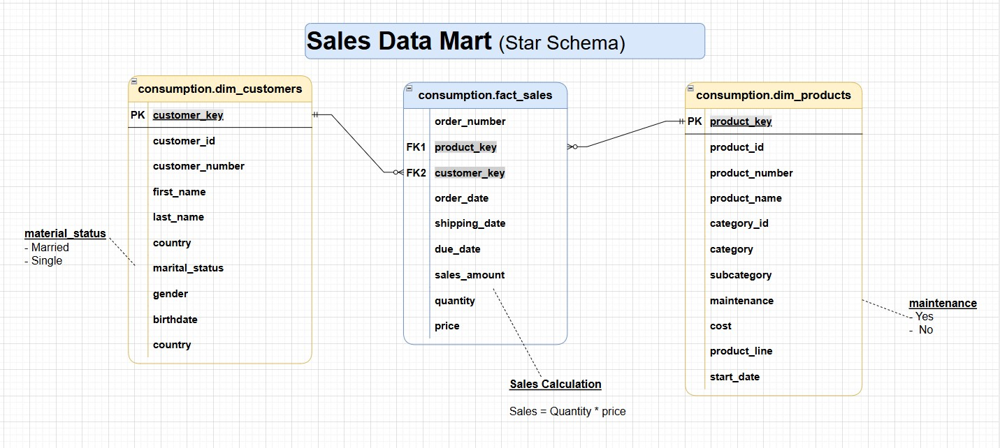

# Enterprise-datawarehouse-AWS


A modern enterprise data warehouse pipeline built using **AWS Glue, AWS Lambda, AWS Step Functions, Amazon RDS (PostgreSQL), and AWS S3** implementing a **multi-layer ETL architecture** with a **Sales Data Mart (Star Schema)** for analytics and reporting.

This project demonstrates **real-world cloud-native data engineering practices**, including:

- Layered Data Warehouse Architecture
- Serverless ETL orchestration using **AWS Step Functions**
- Event-driven transformations using **AWS Lambda**
- Scalable data ingestion using **AWS Glue**
- Dimensional data modeling (**Star Schema**)
- Raw → Curated → Business-ready transformations
- Data lineage and orchestration design

---

# High-Level Architecture

The warehouse follows a **three-layer architecture**:

- **Stage Layer** – Raw ingestion layer  
- **Curated Layer** – Cleaned and standardized data  
- **Consumption Layer** – Analytics-ready star schema  

---

# High-Level Architecture Diagram



---

# Updated Data Flow

```
Source Systems
↓
AWS S3 (CSV files)
↓
AWS Glue (Stage Load)
↓
Amazon RDS PostgreSQL (Stage Layer)
↓
AWS Lambda (Curated Transformations via Stored Procedures)
↓
Amazon RDS PostgreSQL (Curated Layer)
↓
AWS Lambda (Consumption Layer Build)
↓
Amazon RDS PostgreSQL (Consumption Layer - Star Schema)
↓
BI / Analytics / Machine Learning
```

---

# AWS Architecture Overview

This implementation replaces traditional orchestration (**Apache Airflow**) with a fully **serverless AWS-native pipeline**.

## Core AWS Components

| Layer | Service | Responsibility |
|------|--------|---------------|
| Storage | AWS S3 | Source data storage (CSV files) |
| Ingestion | AWS Glue | Load data into Stage tables |
| Processing | AWS Lambda | Execute transformation logic |
| Orchestration | AWS Step Functions | Manage workflow execution |
| Data Warehouse | Amazon RDS (PostgreSQL) | Store Stage, Curated, Consumption layers |
| Monitoring | AWS CloudWatch | Logs and execution tracking |

---

# Orchestration – Step Functions Workflow

The pipeline is orchestrated using: ***ETL_CRM_ERP_Consumption_Workflow***

---



---

# Workflow Execution Logic

## Step 1 — Stage Data Load (Glue Jobs)

- `glue_stage_crm`
- `glue_stage_erp`

Loads raw CSV data from **S3 into Stage tables**.

---

## Step 2 — Curated Layer Processing (Parallel Execution)

- `lambda_curated_crm`
- `lambda_curated_erp`

These run **in parallel** to improve pipeline performance.

### Responsibilities

Execute stored procedures:


curated.load_crm_*
curated.load_erp_*


Perform:

- Data cleansing
- Standardization
- Data normalization

---

## Step 3 — Consumption Layer Build (Sequential Execution)

- `lambda_consumption_dim_customers`
- `lambda_consumption_dim_products`
- `lambda_consumption_fact_sales`

### Execution Order


DimCustomers → DimProducts → FactSales


### Responsibilities

- Build **star schema**
- Generate **surrogate keys**
- Apply **business logic & aggregations**

---

## Step 4 — Error Handling

Each step includes **Catch blocks**.

Failures route to:


❌ FailState


Successful completion routes to:


✅ SuccessState


---

# Data Flow Diagram



---


# Consumption Layer Table Mapping



---

# ETL Pipeline (AWS Version)

## Step 1 — Data Ingestion

Source CSV files are stored in:


AWS S3


**AWS Glue jobs** load them into **Stage Layer tables in RDS**.

---

## Step 2 — Stage Layer

### Purpose

Raw landing zone for source data.

### Characteristics

- No transformations
- Batch ingestion using Glue
- Truncate + Insert
- Schema-on-write

### Tables


stage.crm_sales_details
stage.crm_cust_info
stage.crm_prd_info
stage.erp_cust_az12
stage.erp_loc_a101
stage.erp_px_cat_g1v2


---

## Step 3 — Curated Layer

### Purpose

Clean and standardize raw data.

### Processing Engine

**AWS Lambda + PostgreSQL Stored Procedures**

### Transformations

- Data cleansing
- Standardization
- Normalization
- Derived columns
- Data enrichment

### Tables


curated.crm_sales_details
curated.crm_cust_info
curated.crm_prd_info
curated.erp_cust_az12
curated.erp_loc_a101
curated.erp_px_cat_g1v2


---

## Step 4 — Consumption Layer

### Purpose

Analytics-ready data mart.

### Processing

AWS Lambda executes:


consumption.load_dim_customers()
consumption.load_dim_products()
consumption.load_fact_sales()


### Tables


consumption.fact_sales
consumption.dim_customers
consumption.dim_products


---

# Lambda Functions

## Curated Layer


lambda_curated_crm
lambda_curated_erp


## Consumption Layer


lambda_consumption_dim_customers
lambda_consumption_dim_products
lambda_consumption_fact_sales


---

# Glue Jobs


glue_stage_crm
glue_stage_erp


---

# Repository Structure


enterprise-datawarehouse-001
│
├── glue_jobs
│
├── lambda
│
├── step_functions
│
├── datasets
│ ├── source_crm
│ └── source_erp
│
├── docs
│ ├── data_catalog.md
│ ├── data_flow_diagram.jpg
│ ├── dim_fct_mapping.jpg
│ ├── high_level_architecture.jpg
│ ├── step_function_orchestration.jpg
│ └── naming_conventions.md
│
├── schema_stage
├── schema_curated
├── schema_consumption
│
├── README.md
└── LICENSE


---

# Technology Stack (Updated)

| Component | Technology |
|----------|------------|
| Data Warehouse | Amazon RDS (PostgreSQL) |
| Object Storage | AWS S3 |
| Ingestion | AWS Glue |
| Processing | AWS Lambda + SQL Stored Procedures |
| Orchestration | AWS Step Functions |
| Monitoring | AWS CloudWatch |
| Programming | Python |
| Data Modeling | Star Schema |
| Analytics | BI Tools / SQL |

---

# Key Enhancements Over Previous Architecture

- Removed **Apache Airflow**
- Introduced **serverless orchestration (Step Functions)**
- Parallel processing for **CRM & ERP pipelines**
- Fully **AWS-native scalable architecture**
- Reduced infrastructure management
- Event-driven pipeline execution

---

# Use Cases

- Sales performance analytics
- Customer segmentation
- Product performance insights
- BI dashboards
- Ad-hoc analytics queries
- Machine learning datasets

---

# Future Enhancements

- Incremental data loading
- Slowly Changing Dimensions (SCD)
- Data quality validation
- Metadata management
- Automated testing
- CI/CD pipeline

---

# License

MIT License

---

# Author

**Yaseen Ahamed**

LinkedIn  
https://www.linkedin.com/in/ahamedyaseen0009/
